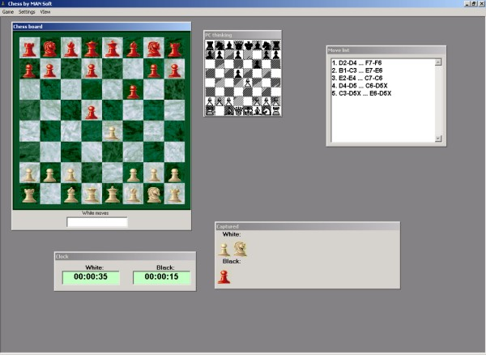



## Complete Chess Game \(With DLL Engine\)

### Description

This Chess Game is unlike any other here on PSC. The main difference is that it has a DLL Chess Engine.

Before I continue, I have to explain that this project was not created by me. It was originally submitted by Marjan Mrak. I only painstakingly translated it from Slovenian to English. You will really admire my effort when you learn that I don't know a single word in Slovenian!!

I only translated the Game project form Slovenian to English. The DLL project is still in Slovenian. However, you can, now, understand how to utilize the DLL. I am planning on translating the Chess Engine DLL, too. However, it is gonna take a while and I am planning to rewrite most of it...

The great advantage of a DLL is that it will greatly facilitate the transportation of the Chess Engine form this project into your Chess Game project. I saw many Chess Game projects here on PSC that allow you to play against another human opponent on your computer or even play against an opponent via the internet. However, I hardly ever have seen a Project where you can play against your own computer. If you have programmed a Chess game that does not have the capability of playing with you, you can, now, add this feature to it.

The Chess Engine is not brilliant but it is a start...

----

Update 12-02-03 at 9:25 AM

----

I have updated the DLL, as suggested by Norm Cook.
 
### More Info
 

             |
---                |---
**Submitted On**   |2003-12-02 09:22:56
**By**             |[Elias Barbosa](https://github.com/Planet-Source-Code/PSCIndex/blob/master/ByAuthor/elias-barbosa.md)
**Level**          |Advanced
**User Rating**    |5.0 (208 globes from 42 users)
**Compatibility**  |VB 6\.0
**Category**       |[Games](https://github.com/Planet-Source-Code/PSCIndex/blob/master/ByCategory/games__1-38.md)
**World**          |[Visual Basic](https://github.com/Planet-Source-Code/PSCIndex/blob/master/ByWorld/visual-basic.md)
**Archive File**   |[Complete\_C1679171222003\.zip](https://github.com/Planet-Source-Code/elias-barbosa-complete-chess-game-with-dll-engine__1-50241/archive/master.zip)

